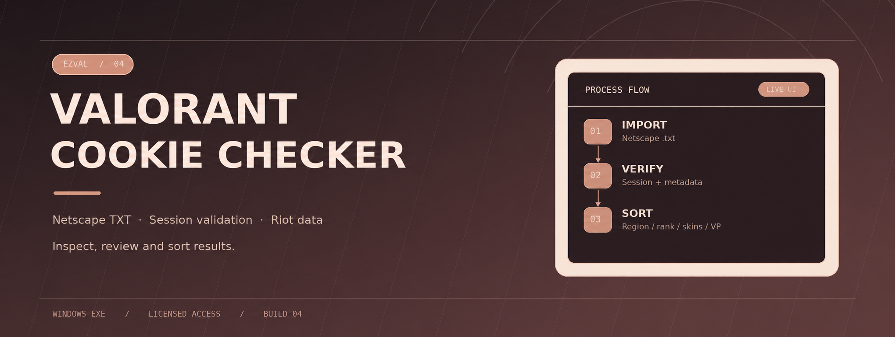
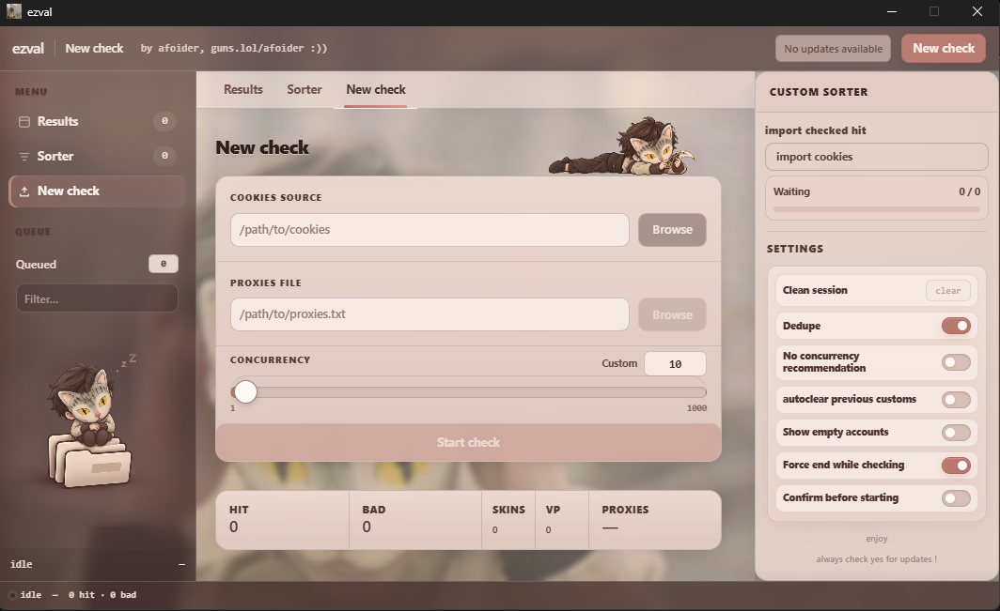
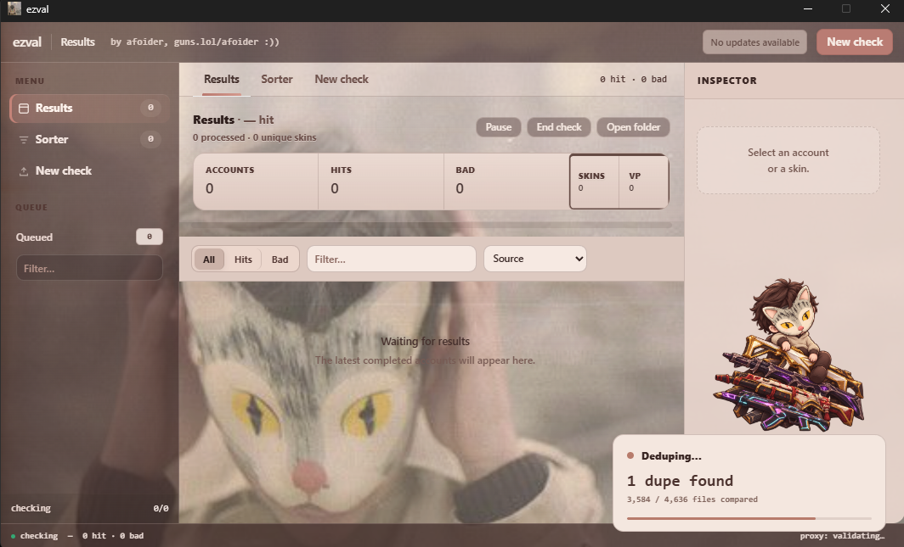
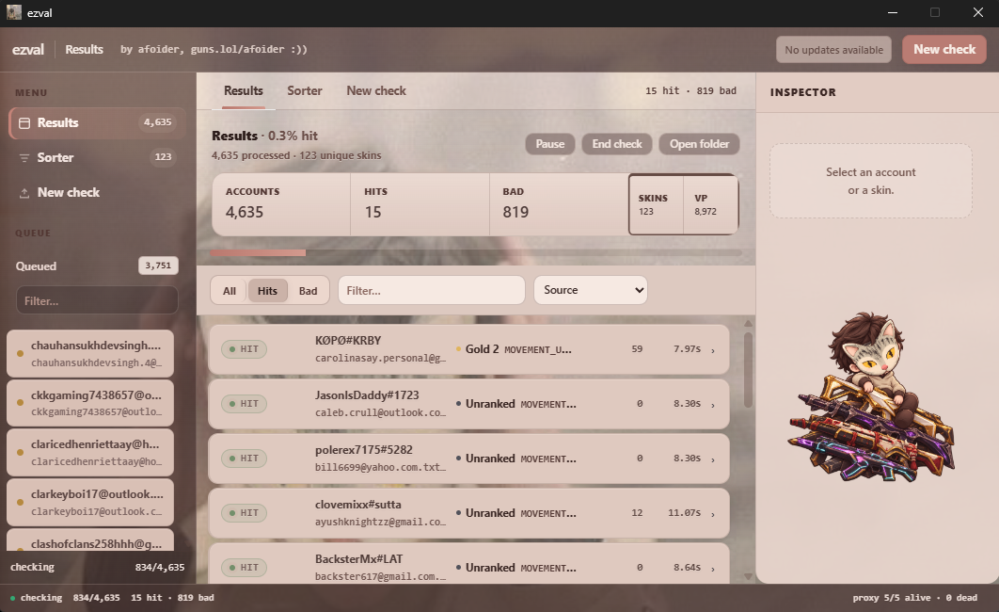
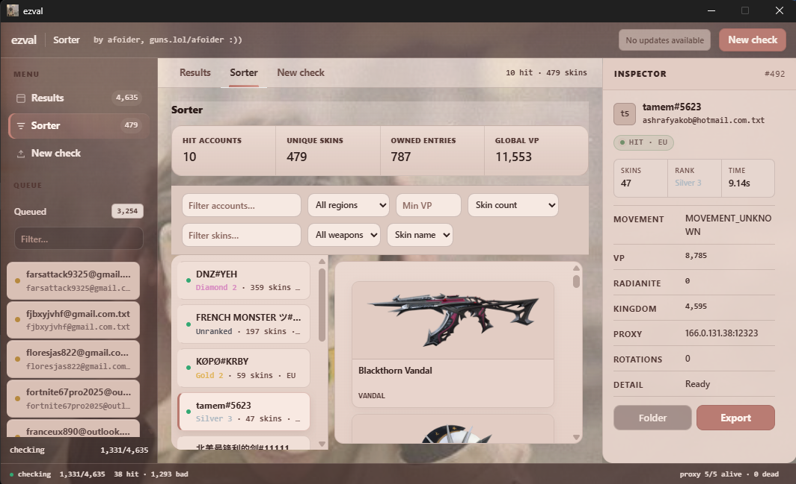

  

  <strong>VALORANT Cookie Checker</strong> 
  A Windows desktop app for analyzing Netscape cookies, viewing VALORANT data, and organizing results.

  <a href="../../releases/latest"><strong>↓ Download the latest EXE</strong></a>
  &nbsp;·&nbsp; Windows &nbsp;·&nbsp; Build 4 &nbsp;·&nbsp; License required

---

### Interface

  

<table>
  <tr>
    <td width="50%" align="center"></td>
    <td width="50%" align="center"></td>
  </tr>
  <tr>
    <td width="50%" align="center"></td>
    <td width="50%" align="center"></td>
  </tr>
</table>

### How it works

| Stage | Process |
| :--- | :--- |
| **01 / Import** | Read a Netscape-format `.txt` cookie file or a folder of files. Optional deduplication skips byte-identical exports. |
| **02 / Check** | Prepare cookies, process sessions, and track the status of each input in the desktop interface. |
| **03 / Enrich** | Retrieve available VALORANT data, including region, rank, skins, and VP balance. Availability depends on the session and remote services. |
| **04 / Organize** | Inspect results, export a JSON summary, and sort by region, rank, skin count, and VP. |

### Technical features

- **Batch processing** with adjustable concurrency, live progress, pause, resume, and stop controls.
- **Deduplication** to avoid processing identical cookie exports more than once.
- **Optional proxies** with preflight validation and status monitoring in the interface.
- **Structured output** with JSON reports and a `sort/<REGION>/` tree containing `skin`, `rank`, `rank & skin`, and `VP` categories.
- **Online license activation** with local state protected by Windows DPAPI. EXE updates are checked against their expected size and SHA-256 hash before replacement.

### Getting started

1. Download the **`.exe`** from **Assets** on the [latest release](../../releases/latest).
2. Run EZVAL on Windows and enter your license key. An internet connection is required to validate it.
3. In **New check**, select a Netscape cookie file or folder that you are authorized to use.
4. Use **Results** to inspect statuses and details, then **Sorter** to browse organized results.

> **Session security:** Cookies are sensitive authentication data. Sorting may create **copies of cookie files** under `sort/`; protect that directory as well. Never post these files in a GitHub issue.
